**Note:** This project is a fork of `opentelemetry-demo`. Thanks to the team and contributors for opensourcing this wonderful demo project. Definitely one of the best on internet.

<!-- markdownlint-disable-next-line -->
#  OpenTelemetry Demo

## Welcome to the OpenTelemetry Astronomy Shop Demo

This repository contains the OpenTelemetry Astronomy Shop, a microservice-based
distributed system intended to illustrate the implementation of OpenTelemetry in
a near real-world environment.

Our goals are threefold:

- Provide a realistic example of a distributed system that can be used to
  demonstrate OpenTelemetry instrumentation and observability.
- Build a base for vendors, tooling authors, and others to extend and
  demonstrate their OpenTelemetry integrations.
- Create a living example for OpenTelemetry contributors to use for testing new
  versions of the API, SDK, and other components or enhancements.

We've already made [huge
progress](https://github.com/open-telemetry/opentelemetry-demo/blob/main/CHANGELOG.md),
and development is ongoing. We hope to represent the full feature set of
OpenTelemetry across its languages in the future.

If you'd like to help (**which we would love**), check out our [contributing
guidance](./CONTRIBUTING.md).

If you'd like to extend this demo or maintain a fork of it, read our
[fork guidance](https://opentelemetry.io/docs/demo/forking/).

## Quick start

You can be up and running with the demo in a few minutes. Check out the docs for
your preferred deployment method:

- [Docker](https://opentelemetry.io/docs/demo/docker_deployment/)
- [Kubernetes](https://opentelemetry.io/docs/demo/kubernetes_deployment/)

## Documentation

For detailed documentation, see [Demo Documentation][docs]. If you're curious
about a specific feature, the [docs landing page][docs] can point you in the
right direction.

## Demos featuring the Astronomy Shop

We welcome any vendor to fork the project to demonstrate their services and
adding a link below. The community is committed to maintaining the project and
keeping it up to date for you.

|                           |                |                                  |
|---------------------------|----------------|----------------------------------|
| [AlibabaCloud LogService] | [Elastic]      | [OpenSearch]                     |
| [AppDynamics]             | [Google Cloud] | [Sentry]                         |
| [Aspecto]                 | [Grafana Labs] | [ServiceNow Cloud Observability] |
| [Axiom]                   | [Guance]       | [Splunk]                         |
| [Axoflow]                 | [Honeycomb.io] | [Sumo Logic]                     |
| [Azure Data Explorer]     | [Instana]      | [TelemetryHub]                   |
| [Coralogix]               | [Kloudfuse]    | [Teletrace]                      |
| [Dash0]                   | [Liatrio]      | [Tracetest]                      |
| [Datadog]                 | [Logz.io]      | [Uptrace]                        |
| [Dynatrace]               | [New Relic]    |                                  |

## Contributing

To get involved with the project see our [CONTRIBUTING](CONTRIBUTING.md)
documentation. Our [SIG Calls](CONTRIBUTING.md#join-a-sig-call) are every other
Monday at 8:30 AM PST and anyone is welcome.

## Project leadership

[Maintainers](https://github.com/open-telemetry/community/blob/main/guides/contributor/membership.md#maintainer)
([@open-telemetry/demo-maintainers](https://github.com/orgs/open-telemetry/teams/demo-maintainers)):

- [Juliano Costa](https://github.com/julianocosta89), Datadog
- [Mikko Viitanen](https://github.com/mviitane), Dynatrace
- [Pierre Tessier](https://github.com/puckpuck), Honeycomb

[Approvers](https://github.com/open-telemetry/community/blob/main/guides/contributor/membership.md#approver)
([@open-telemetry/demo-approvers](https://github.com/orgs/open-telemetry/teams/demo-approvers)):

- [Cedric Ziel](https://github.com/cedricziel) Grafana Labs
- [Penghan Wang](https://github.com/wph95), AppDynamics
- [Reiley Yang](https://github.com/reyang), Microsoft
- [Roger Coll](https://github.com/rogercoll), Elastic
- [Ziqi Zhao](https://github.com/fatsheep9146), Alibaba

Emeritus:

- [Austin Parker](https://github.com/austinlparker)
- [Carter Socha](https://github.com/cartersocha)
- [Michael Maxwell](https://github.com/mic-max)
- [Morgan McLean](https://github.com/mtwo)

### Thanks to all the people who have contributed

[docs]: https://opentelemetry.io/docs/demo/

<!-- Links for Demos featuring the Astronomy Shop section -->

[AlibabaCloud LogService]: https://github.com/aliyun-sls/opentelemetry-demo
[AppDynamics]: https://www.appdynamics.com/blog/cloud/how-to-observe-opentelemetry-demo-app-in-appdynamics-cloud/
[Aspecto]: https://github.com/aspecto-io/opentelemetry-demo
[Axiom]: https://play.axiom.co/axiom-play-qf1k/dashboards/otel.traces.otel-demo-traces
[Axoflow]: https://axoflow.com/opentelemetry-support-in-more-detail-in-axosyslog-and-syslog-ng/
[Azure Data Explorer]: https://github.com/Azure/Azure-kusto-opentelemetry-demo
[Coralogix]: https://coralogix.com/blog/configure-otel-demo-send-telemetry-data-coralogix
[Dash0]: https://github.com/dash0hq/opentelemetry-demo
[Datadog]: https://docs.datadoghq.com/opentelemetry/guide/otel_demo_to_datadog
[Dynatrace]: https://www.dynatrace.com/news/blog/opentelemetry-demo-application-with-dynatrace/
[Elastic]: https://github.com/elastic/opentelemetry-demo
[Google Cloud]: https://github.com/GoogleCloudPlatform/opentelemetry-demo
[Grafana Labs]: https://github.com/grafana/opentelemetry-demo
[Guance]: https://github.com/GuanceCloud/opentelemetry-demo
[Honeycomb.io]: https://github.com/honeycombio/opentelemetry-demo
[Instana]: https://github.com/instana/opentelemetry-demo
[Kloudfuse]: https://github.com/kloudfuse/opentelemetry-demo
[Liatrio]: https://github.com/liatrio/opentelemetry-demo
[Logz.io]: https://logz.io/learn/how-to-run-opentelemetry-demo-with-logz-io/
[New Relic]: https://github.com/newrelic/opentelemetry-demo
[OpenSearch]: https://github.com/opensearch-project/opentelemetry-demo
[Sentry]: https://github.com/getsentry/opentelemetry-demo
[ServiceNow Cloud Observability]: https://docs.lightstep.com/otel/quick-start-operator#send-data-from-the-opentelemetry-demo
[Splunk]: https://github.com/signalfx/opentelemetry-demo
[Sumo Logic]: https://www.sumologic.com/blog/common-opentelemetry-demo-application/
[TelemetryHub]: https://github.com/TelemetryHub/opentelemetry-demo/tree/telemetryhub-backend
[Teletrace]: https://github.com/teletrace/opentelemetry-demo
[Tracetest]: https://github.com/kubeshop/opentelemetry-demo
[Uptrace]: https://github.com/uptrace/uptrace/tree/master/example/opentelemetry-demo

⚙️ Setup

1. Provision Infrastructure with Terraform using the Terminal

Before deploying workloads, use Terraform to provision your base AWS infrastructure:

VPC, Subnets, Route Tables, Security Groups

EKS Cluster + Node Groups

IAM roles (for ALB controller, EBS CSI driver, etc.)

Example Terraform workflow:

# Initialize Terraform
terraform init

# Review plan
terraform plan

# Apply infrastructure
terraform apply -auto-approve

✅ Output from Terraform should include:

cluster_name

vpc_id

region

eks_cluster_oidc_arn

2. Launch an Amazon EC2 t2.xlarge instance (recommended for demo workloads).

Use Amazon Linux 2 or Ubuntu 22.04 as the base image.

Ensure the instance has:

Access to your EKS cluster (via IAM role or aws configure)

Installed tools:

kubectl

helm

git

awscli

docker

eksctl

Install Tools on EC2
# Update packages
sudo apt-get update -y

# Install AWS CLI v2
curl "https://awscli.amazonaws.com/awscli-exe-linux-x86_64.zip" -o "awscliv2.zip"
unzip awscliv2.zip
sudo ./aws/install

# Install kubectl (latest stable)
curl -o kubectl https://s3.us-west-2.amazonaws.com/amazon-eks/1.29.0/2024-06-04/bin/linux/amd64/kubectl
chmod +x ./kubectl
sudo mv ./kubectl /usr/local/bin/

# Install eksctl
curl -sL "https://github.com/weaveworks/eksctl/releases/latest/download/eksctl_$(uname -s)_amd64.tar.gz" | tar xz
sudo mv eksctl /usr/local/bin

# Install Helm
curl https://raw.githubusercontent.com/helm/helm/main/scripts/get-helm-3 | bash

# Verify installations
kubectl version --client
eksctl version
helm version
aws --version

3. Clone the Repository
git clone https://github.com/<your-username>/opentelemetry-demo.git
cd opentelemetry-demo

4. Write Docker Compose & Build App Locally

Inside your project directory, create a docker-compose.yaml file for your microservices app or use the OpenTelemetry Demo sample.

Example (docker-compose.yaml): refer to documentation

version: "3.8"
services:
  frontend:
    build: ./frontend
    ports:
      - "8080:8080"

  checkout:
    build: ./checkout
    ports:
      - "8081:8081"

Build and run locally on your EC2:

docker compose up --build

Verify services are running:

docker ps

✅ This step validates your application images before deploying them to EKS.

5. How to Setup ALB Add-on
5.1 Setup OIDC Connector
export cluster_name=demo-cluster

oidc_id=$(aws eks describe-cluster --name $cluster_name --query "cluster.identity.oidc.issuer" --output text | cut -d '/' -f 5) 

Check if there is an IAM OIDC provider configured:

aws iam list-open-id-connect-providers | grep $oidc_id | cut -d "/" -f4

If not, associate the OIDC provider:

eksctl utils associate-iam-oidc-provider --cluster $cluster_name --approve

5.2 Create IAM Policy

Download the IAM policy:

curl -O https://raw.githubusercontent.com/kubernetes-sigs/aws-load-balancer-controller/v2.11.0/docs/install/iam_policy.json

Create IAM policy:

aws iam create-policy \
  --policy-name AWSLoadBalancerControllerIAMPolicy \
  --policy-document file://iam_policy.json

5.3 Create IAM Role for ALB Controller
eksctl create iamserviceaccount \
  --cluster=<your-cluster-name> \
  --namespace=kube-system \
  --name=aws-load-balancer-controller \
  --role-name AmazonEKSLoadBalancerControllerRole \
  --attach-policy-arn=arn:aws:iam::<your-aws-account-id>:policy/AWSLoadBalancerControllerIAMPolicy \
  --approve

5.4 Deploy ALB Controller

Add Helm repo:

helm repo add eks https://aws.github.io/eks-charts

Update repo:

helm repo update eks

Install ALB controller:

helm install aws-load-balancer-controller eks/aws-load-balancer-controller \            
  -n kube-system \
  --set clusterName=<your-cluster-name> \
  --set serviceAccount.create=false \
  --set serviceAccount.name=aws-load-balancer-controller \
  --set region=<region> \
  --set vpcId=<your-vpc-id>

Verify deployment:

kubectl get deployment -n kube-system aws-load-balancer-controller

6. Deploy the OpenTelemetry Demo
kubectl apply -f k8s/

7. Configure Ingress

The provided ingress.yaml configures:

HTTP (80) → HTTPS (443) redirection

TLS termination using your ACM certificate

Routing traffic to the frontend service

kubectl apply -f ingress.yaml

⚠️ Note: Update the certificate ARN in ingress.yaml with your ACM certificate.

### 1. EKS Cluster Creation
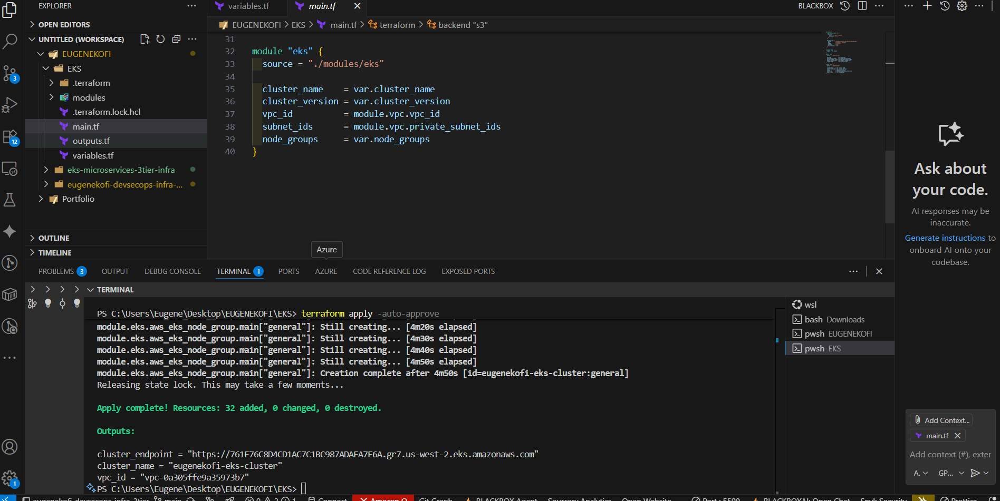

### 2. EKS Cluster View 
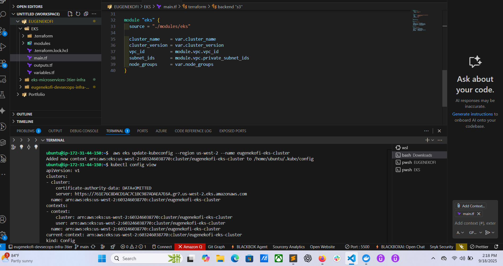

### 3. Remote Backend View 
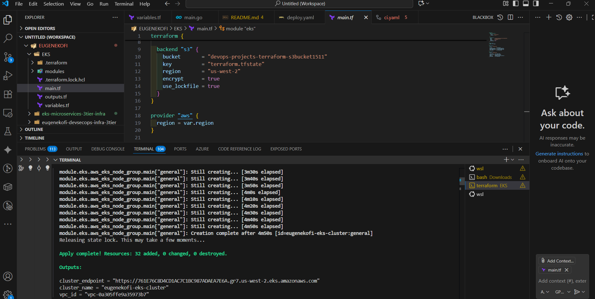

### 4. EKS Cluster in AWS
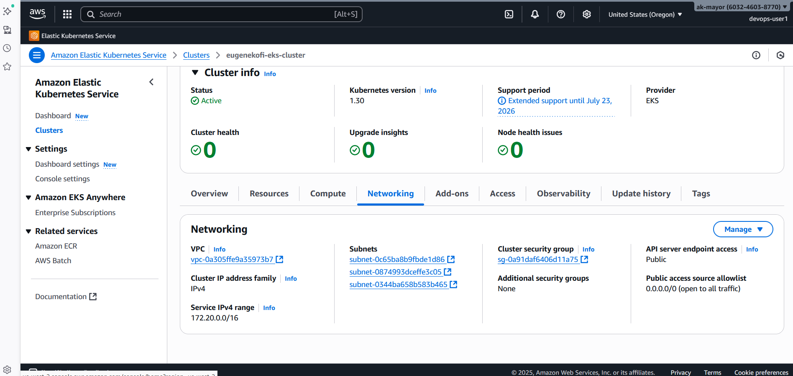

### 5. CI View
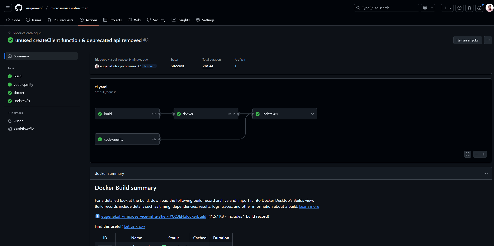

### 6. Feature & Main Branch Merge
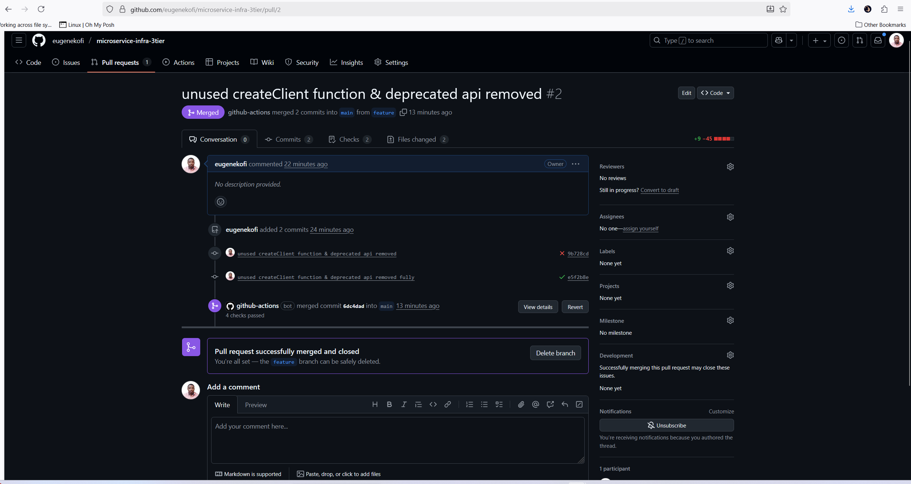

### 7. No Conflict View 
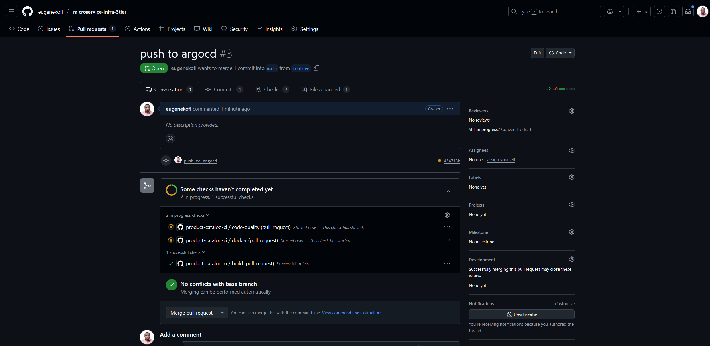

### 8. Frontend View
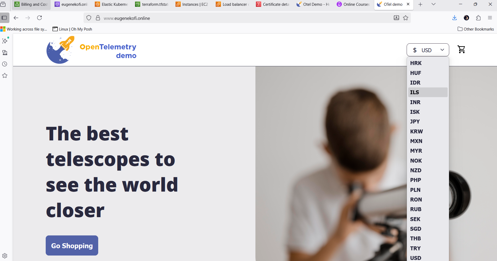

### 9. Products
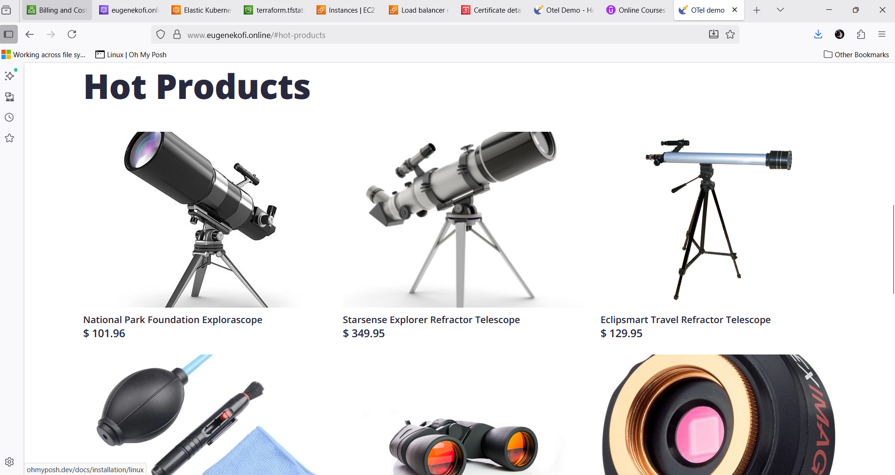

### 10. Cart Setup
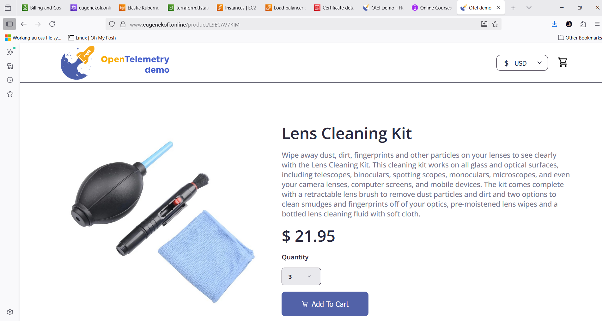

### 11. Quantity Setup
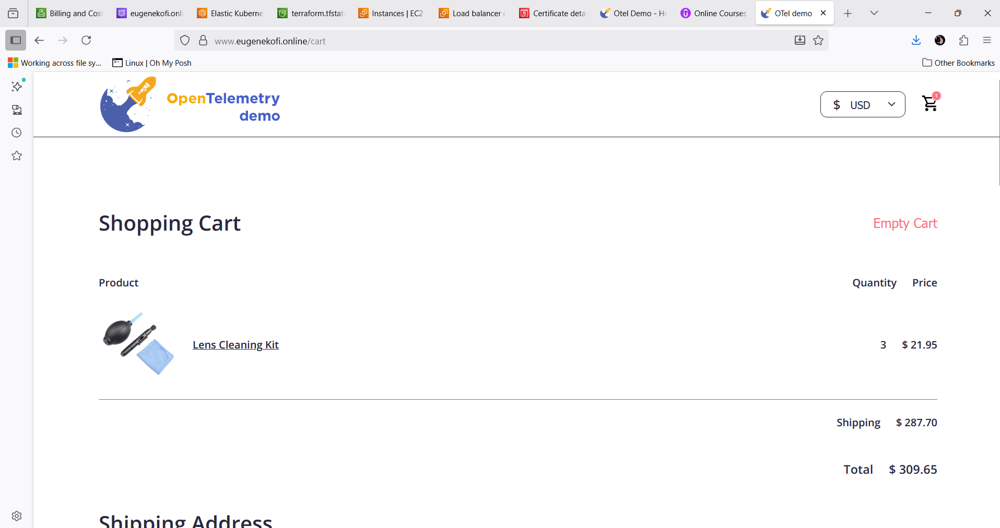

### 12. Shipping Address
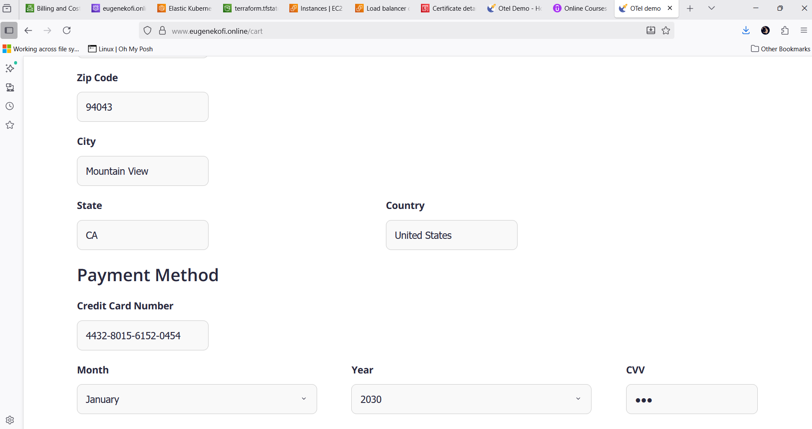

### 13. Order Complete
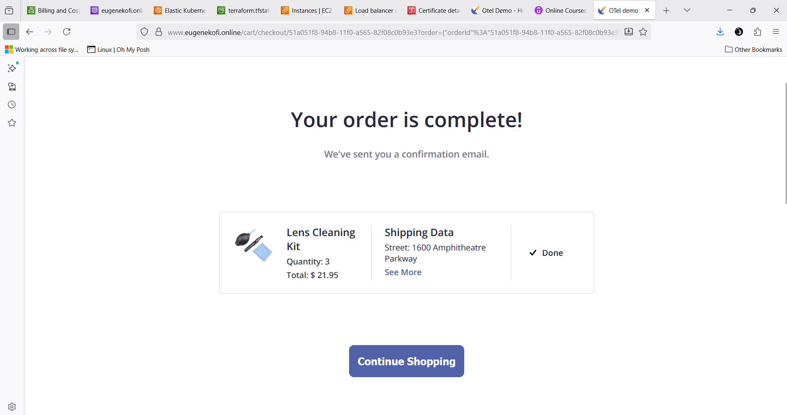

### 14. Reviews
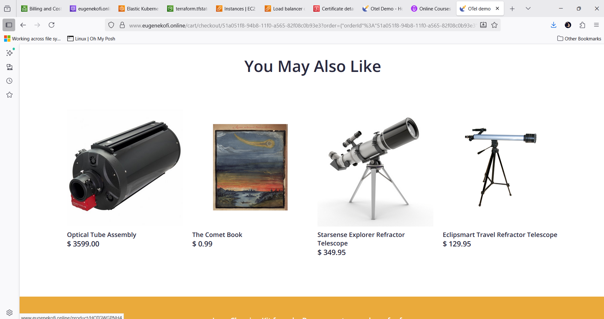

### 15. ARgoCD
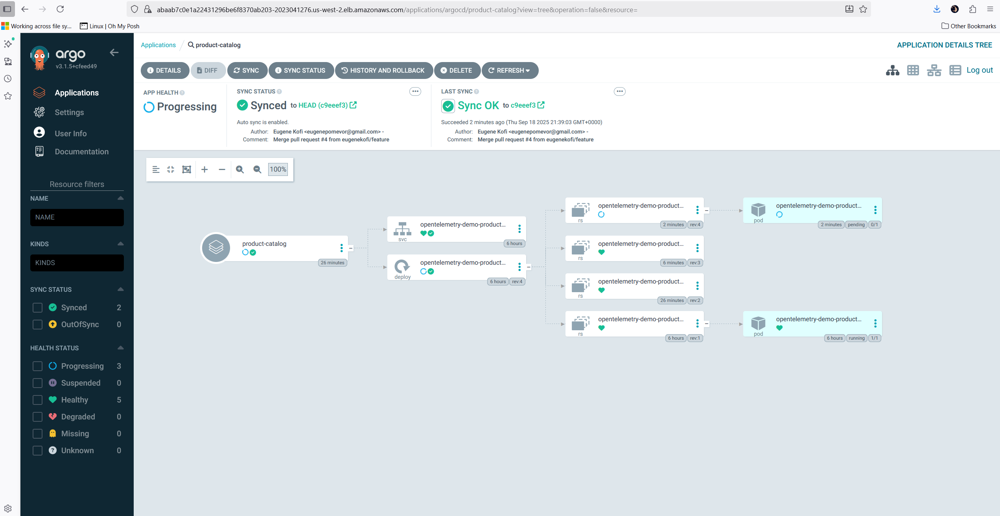